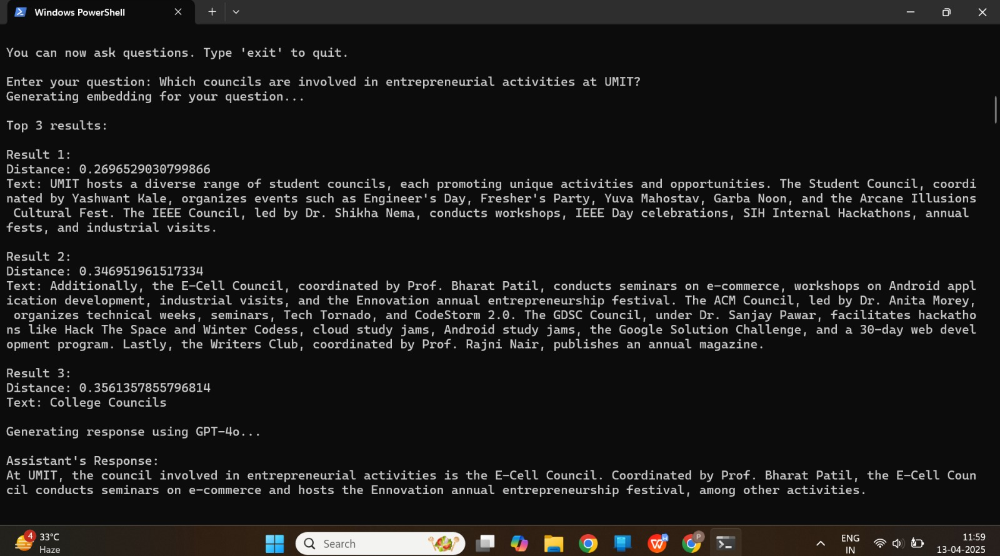
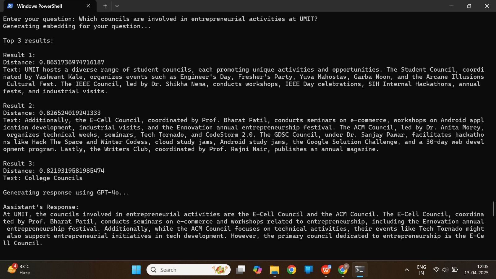
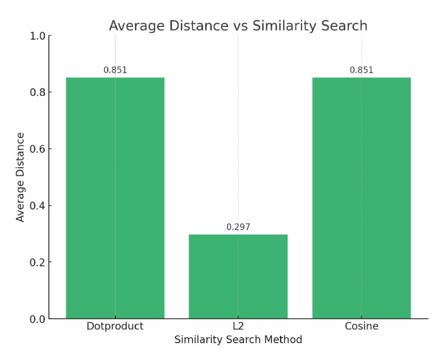

# Ragify

A Retrieval-Augmented Generation (RAG) system built using OpenAI Embeddings and FAISS.

---

## Overview

Ragify allows users to upload and query information from:

- 📄 PDF files
- 📝 Word documents
- 📊 Excel spreadsheets

The system converts document content into embeddings and stores them in a FAISS vector database for semantic search. The retrieved context is then passed to GPT-4o to generate accurate answers.

---

## Features

- Multi-document support
- PDF, DOCX and XLSX ingestion
- OpenAI Embeddings
- GPT-4o response generation
- FAISS Vector Search
- Three similarity search techniques

---

## Similarity Techniques

- L2 Distance
- Dot Product
- Cosine Similarity

---

## Tech Stack

- Python
- OpenAI API
- FAISS
- NumPy
- Pandas
- PyPDF2
- python-docx

---

## Workflow

1. Load documents
2. Extract text
3. Generate embeddings
4. Store embeddings in FAISS
5. Retrieve relevant chunks
6. Generate responses using GPT-4o

---

## Project Screenshots

### L2 Distance

---

### Dot Product

---

### Cosine Similarity

---

### Comparison Chart

---

## Future Improvements

- Streamlit Web Interface
- Chat History
- Source Citation
- Cloud Deployment
- Support for Multiple Embedding Models

---

## Team Project

This project was developed as a team of three members during our academic work.

### Team Members

- Sarah Kazi
- Khushi Patel
- Shreya Pendurkar

### My Contributions

- Project development
- Worked with OpenAI embeddings and FAISS integration.
- Assisted in testing, documentation, and project integration.
